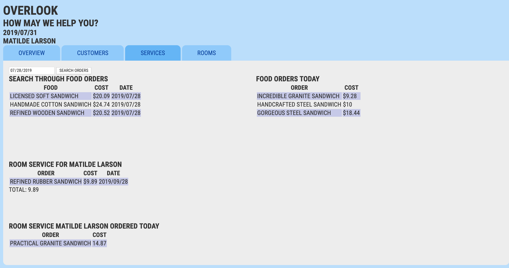

# Overlook Hotel Management App

Overlook is a mockup of a hotel management app. I used fetched JSON data and a number of Object, Array, String, and Number prototype methods to manipulate the data. This is my first solo project using webpack. I also used jQuery to add things to the DOM and SCSS for styling.

## How to Get it Working

1. Clone down this repo. 
1. Save the dependencies by running `npm install`
1. Enjoy navigating the page.

## How to Run the Tests

1. There are a comprehensive set of mocha/chai tests for all classes, properties, and methods.
1. Run tests by typing npm test in your terminal in your cloned directory.

## Goals and Objectives

1. Implement ES6 classes that communicate to each other as needed.
1. Write modular, reusable code adhereing to SRP
1. Substitution Principle, Interface Segregation Principle, Dependency Inversion Principle, and Test Driven Development.
1. Implement a robust testing environment using Mocha and Chai.
1. Use object and array prototype methods to perform rich data manipulation.
1. Display information on the page while maintaining ability to test class properties and methods.
1. Create a dash that is easy to follow and displays information in a clear and consise way.

